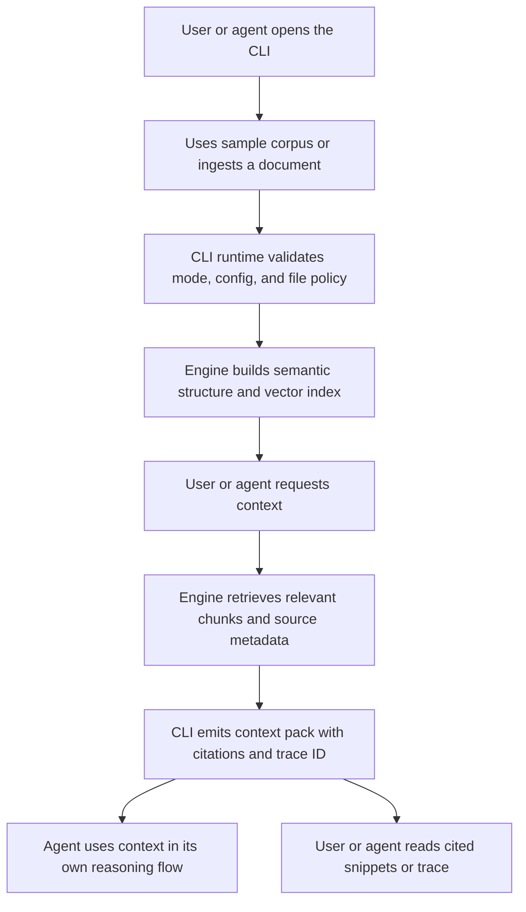

# UX Flows

The UX should prove the product's core value quickly: load a corpus, retrieve cited context, inspect sources, and let an external agent use the evidence. The primary surface is the CLI; public packaged demos use preloaded sample documents with uploads disabled; local/private demos enable imports after warnings and retrieve from imported documents only.

## Command map

| Command / mode | Purpose |
|---|---|
| `health` | Confirm the CLI runtime and local state are usable |
| `ingest` | Load and index a document into the private corpus, or explicitly process the pending ingestion backlog |
| `refresh` | Rebuild index data and metadata for already-ingested sources |
| `list` | Show corpus documents and statuses |
| `get` | Show one document's metadata and ingestion state |
| `search` | Return ranked snippets for a natural-language retrieval query |
| `retrieve` | Return chunk-level retrieval records for agent/tool use |
| `context` | Build an agent-consumable context pack with citations and trace metadata |
| `read` | Read a cited chunk/source snippet by citation ID or chunk ID |
| `trace` | Inspect retrieval/context trace metadata |
| `retry` | Reprocess a failed document |

## Happy path

## Flow 1 — Ingest document

This flow applies to local/private mode, where imports create documents in the private corpus. In the public packaged demo, `ingest` is disabled and the CLI explains that sample documents are preloaded.

1. User or agent calls `ingest`.
2. CLI loads config using documented precedence and shows the no-sensitive-data/provider disclosure warning when applicable.
3. User or agent provides a supported file through the documented path/capability policy.
4. Engine validates file type and size.
5. Engine atomically records or updates a durable document/job/backlog record for the same path/corpus before active processing. Duplicate `ingest <path>` calls for the same corpus upsert the existing record and return the existing document/backlog ID rather than creating duplicate rows.
6. The command acquires the ingestion lock before active processing.
7. If the lock is available, the command processes one document in the same invocation and persists final or resumable state before exit.
8. If another command holds the lock, the backlog upsert remains committed and the command returns `operation_in_progress` with `retry_after_seconds`; it does not start hidden background work or drain a queue.
9. Pending/backlog documents are processed only by an explicit invocation such as `ingest --next` or `ingest --queued`.
10. CLI shows document status:
   - `pending`
   - `processing`
   - `ready`
   - `failed`

### Required states

| State | Output |
|---|---|
| Empty | “Load a document to start retrieving context.” |
| Processing | “Indexing your document. This command may take a moment.” |
| Ready | “Document ready. Agents can retrieve context now.” |
| Failed | “We could not index this document after retrying: <reason>. You can retry indexing after fixing the file/provider issue.” |

## Flow 2 — Build a context pack

1. User or agent calls `context` with a natural-language retrieval query.
2. CLI runtime checks durable rate-limit state and returns `rate_limit_exceeded` if the configured window is exhausted.
3. Engine retrieves relevant chunks from `ready` documents in the active corpus.
4. If the active corpus also has `pending` or `processing` documents, engine returns partial-corpus metadata and CLI shows: “Some documents are still indexing, so this context used ready documents only.”
5. Engine assembles an agent-consumable context pack without calling a built-in answer-generation LLM.
6. CLI displays or emits JSON with:
   - ranked chunks/snippets;
   - citation IDs;
   - sanitized source labels;
   - retrieval scores and ranking metadata when available;
   - trace ID and request metadata;
   - disclaimer that downstream AI answers must be verified against cited sources.
7. Follow-up-style messages are treated as stateless new retrieval requests for MVP; persistent conversation memory is post-MVP.

## Flow 3 — Search and retrieve chunks

1. User or agent calls `search` for a concise ranked overview or `retrieve` for chunk-level JSON.
2. CLI applies the same readiness, rate-limit, and partial-corpus rules as `context`.
3. Engine returns ranked chunks and citation metadata.
4. The agent can call `read` to expand a specific citation or chunk.

### Refresh indexed sources

1. User or agent calls `refresh` for one `ready` document or all ready already-ingested sources.
2. CLI acquires the ingestion lock; if another ingestion/refresh is active, it returns `operation_in_progress` with `retry_after_seconds`.
3. Engine rebuilds extracted metadata, chunks, embeddings, indexes, and minimal source/section/chunk relationships in staging.
4. During refresh, `search`, `retrieve`, `context`, and `read` continue to see the last ready snapshot; if no prior ready snapshot exists, they return `document_not_ready`.
5. When refresh succeeds, storage atomically swaps the staged snapshot into the current ready version. Pending or processing documents return `document_not_ready`; failed documents use `retry`, not `refresh`.
6. CLI emits machine-readable status, changed counts, and any per-document errors.

### Failed ingestion recovery

When ingestion fails or reaches the retry cap:

1. CLI keeps the document in `failed` state with a human-readable reason and machine-readable error code.
2. Partial chunks/text/minimal metadata records from the failed attempt are not shown in retrieval or citations.
3. User can trigger `retry` after fixing the file/provider issue; retry reprocesses the document from a clean ingestion state.
4. If retry is not useful, README manual reset/delete steps remain the MVP cleanup path for local/private data.

## Flow 4 — Verify citations

1. User or agent calls `read`, `trace`, or inspects citation output from `context`/`retrieve`.
2. CLI shows:
   - document label;
   - cited chunk/snippet text;
   - page or offset when available;
   - retrieval score if available;
   - trace ID and ranking metadata.
3. User or agent compares downstream answers against evidence.
4. Exporting the original uploaded file is post-MVP unless trivial to add safely.

## Flow 5 — Not enough context

If the corpus does not support the retrieval request:

1. Engine does not invent an answer.
2. If every candidate is below `evidence_floor`, CLI returns `no_results` with empty citations.
3. If evidence is at or above `evidence_floor` but below `confidence_threshold`, or if the query has only partial coverage, CLI returns `insufficient_context` with cautious metadata and any relevant low-confidence snippets clearly marked.
4. Example: “No relevant context found in the ready documents. Try loading more context or rephrasing the query.”

## UX copy principles

- Be direct, not cute.
- Distinguish source text from downstream generated text produced by an external agent.
- Always provide the next action after an error.
- Make citations easy to scan.
- Keep the machine-readable output stable for agents.
- Make concurrency explicit: use durable lock messages, not chat-style disabled states.

## Related docs

- [Functional Requirements](./04-functional-requirements.md)
- [AI and Retrieval Design](./08-ai-retrieval-design.md)
- [Acceptance Criteria](./10-acceptance-criteria.md)
