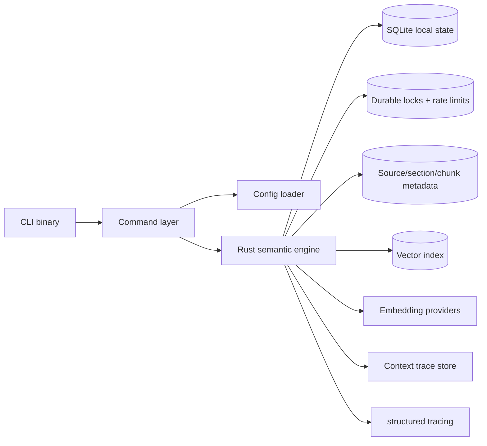

# System Architecture

The MVP should be CLI-first, local-first, and built around a Rust engine. The CLI provides the operator and agent surface; the engine owns ingestion, retrieval, semantic structure, persistence, context-pack assembly, source inspection, and governance trace generation. A native app may become a future adapter, but it is not part of the MVP contract.

## Recommended MVP stack

| Layer | Recommended choice | Reason |
|---|---|---|
| CLI surface | Rust CLI binary | Stable tool contract for agents and operators |
| Core engine | Rust library crate | Ingestion orchestration, retrieval, context-pack assembly, refusal/no-results behavior, and trace assembly live here |
| Persistence | SQLite via rusqlite/libsql; optional Turso sync later | Local-first durability with an upgrade path for sync |
| Semantic retrieval | Vector search plus minimal source/section/chunk metadata | Keep the MVP grounded without overbuilding graph traversal before retrieval quality is proven |
| Graph storage | SQLite tables for document / section / chunk / citation/source relationships | Avoid external graph infrastructure and keep graph scope minimal for the MVP |
| Providers | Embedding provider abstraction in Rust; answer-generation providers are post-MVP adapters | Keep retrieval provider choice swappable without centering the MVP on an internal assistant |
| Runtime | Single-shot durable CLI invocations with Tokio for bounded async work | Each command can do async work, persist state, and exit without requiring a daemon |
| Observability | tracing + structured logs | Debugging without stdout noise |
| Packaging | Reproducible CLI bundles and local builds | Installable artifacts for reviewers |
| Future native app | Deferred | Not part of the MVP contract |

## Component diagram

## Module boundaries

| Module | Responsibility |
|---|---|
| `crates/engine/` | Retrieval orchestration, context-pack assembly, no-results policy, and governance trace assembly |
| `crates/storage/` | Database access, migrations, durable records, locks, rate-limit state, and manual reset/delete support |
| `crates/config/` | Config file loading, env/flag precedence, path resolution, and redacted diagnostics |
| `crates/graph/` | Minimal document, section, chunk, citation, and source relationships needed for trace/read |
| `crates/retrieval/` | Vector chunk ranking, citation assembly, source metadata lookup, and context-pack helpers |
| `crates/ingest/` | File validation, text extraction, chunking, embedding orchestration, and minimal metadata construction |
| `crates/providers/` | Embedding provider abstractions for MVP; optional answer providers only in post-MVP adapters |
| `crates/cli/` | Command parsing, output modes, exit codes, and shell-friendly UX |
| `crates/common/` | Shared types, error definitions, and schema helpers |

## Process model — single-shot durable CLI

The MVP has no required daemon. Each command:

1. Starts a new process.
2. Loads config using the documented precedence rules.
3. Opens local state, cache, index, lock, backlog, and rate-limit stores.
4. Acquires any required durable lock.
5. Performs bounded work.
6. Persists all state needed by future invocations.
7. Releases locks and exits with a documented exit code.

Implications:

- Ingestion progress is durable, not in-memory session state.
- Rate limits are stored in local durable state/data keyed exactly by `runtime_mode + corpus_id + provider_id + retrieval_scope`; they do not reset just because a process exits.
- Concurrent active ingestion/refresh commands use durable locks. If the ingestion lock is held, `ingest <path>` atomically upserts a same-path/same-corpus backlog record, returns `operation_in_progress` with `retry_after_seconds`, and exits.
- Durable backlog records are processed only by explicit CLI invocations such as `ingest --next` or `ingest --queued`; no hidden daemon drains them.
- `list`, `get`, `read`, and `trace` report persisted state; they do not imply a background worker is running.
- A future daemon can wrap this model, but MVP correctness cannot depend on one.

## Data flow — ingestion

1. User or agent calls the CLI `ingest` command.
2. The command layer validates runtime mode, config, and path/capability policy.
3. The Rust engine validates file type and size, then atomically records or upserts a durable document/job/backlog record for the same path/corpus.
4. The engine acquires the ingestion lock before active processing; if the lock is held, it returns `operation_in_progress` after committing the backlog upsert.
5. The extractor reads and normalizes document text.
6. The chunker splits text with overlap.
7. The metadata builder creates minimal document, section, chunk, citation/source relationship records.
8. The embedding service generates vectors.
9. Storage persists the document, metadata, chunks, vectors, indexes, and ingestion state.
10. The document is marked `ready` or `failed` and the command exits. Refresh rebuilds ready documents in staging and atomically swaps the new snapshot; retrieval/read commands keep using the last ready snapshot during refresh.

## Data flow — context retrieval

1. User or agent calls `search`, `retrieve`, or `context`.
2. The command layer validates runtime mode, config, and durable rate-limit state.
3. The retrieval layer gets top-k chunks from the vector index and attaches minimal source/section/chunk metadata for citations and traceability.
4. The engine applies the configured relevance threshold and partial-corpus rules.
5. The engine assembles citations, source metadata, retrieval metadata, and a governance trace.
6. The CLI renders human-readable output or JSON output depending on the selected mode.
7. Any downstream answer generation is performed by an external agent or future optional adapter, not by the MVP core.

## Architecture decisions

| Decision | Rationale |
|---|---|
| Start with one corpus | Reduces tenancy and auth complexity |
| Keep citations first-class | Trust and verification are the product differentiator |
| Expose context, not built-in answers | Keeps the MVP a harness for arbitrary agents instead of an app-hosted assistant |
| Abstract embedding providers | Keeps model choice flexible and cheaper to evolve |
| Use a CLI from day one | Makes the product agent-friendly without a separate UI layer |
| Defer native app | Keeps the MVP focused on the engine and contract |
| Defer MCP | The CLI JSON contract should be stable before wrapping it as a protocol server |
| Vector-first retrieval with minimal metadata | Avoids overbuilding full hybrid ranking or graph traversal before the core retrieval loop is reliable |
| Durable single-shot process model | Matches normal CLI/agent invocation patterns without requiring a resident service |
| Sequential ingestion lock | Avoids SQLite write contention and embedding provider overload |
| SQLite WAL mode | Use WAL journal mode and busy timeout for concurrent read/write access between ingestion and retrieval |
| Schema migrations | Embed a migration version table and run migrations on command startup; schema changes are versioned with the CLI |
| HTTPS-only providers | All external AI and embedding API calls must use HTTPS; non-TLS endpoints are rejected at the HTTP client level |
| Partial failure cleanup | Failed ingestion must roll back or mark partial chunks/text/metadata records for cleanup to prevent orphaned data |
| Ingestion recovery on startup | Interrupted `processing` documents follow the bounded retry/backoff policy, then move to terminal `failed` after the retry cap to prevent zombie states or infinite retries |

## Related docs

- [MVP Scope](./03-mvp-scope.md)
- [Functional Requirements](./04-functional-requirements.md)
- [Non-Functional Requirements](./05-non-functional-requirements.md)
- [AI and Retrieval Design](./08-ai-retrieval-design.md)
- [API Contract](./09-api-contract.md)
